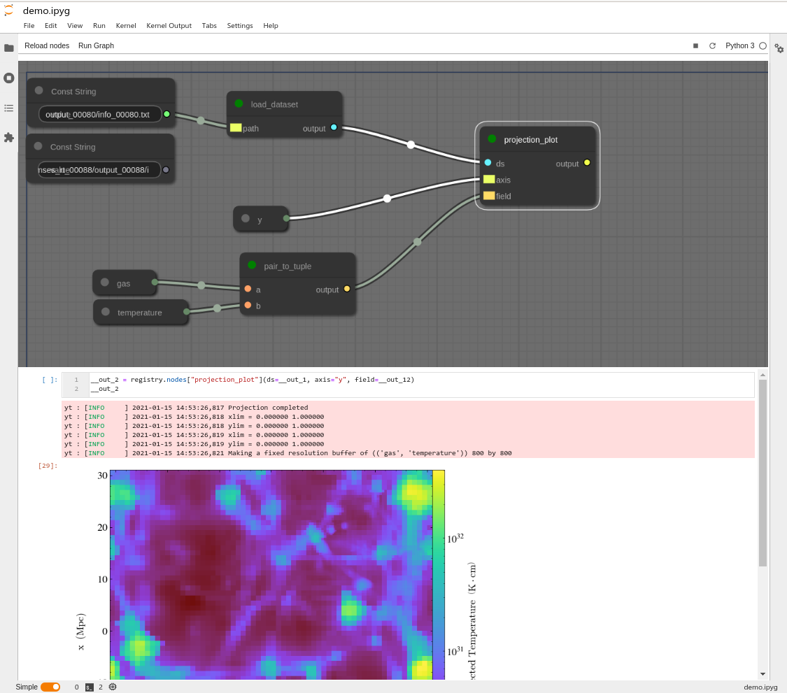

# IpySpaghetti — WORK IN PROGRESS

[](https://mybinder.org/v2/gh/cphyc/ipyspaghetti/main?urlpath=lab/tree/example/demo.ipyg)

A JupyterLab extension.

This extension is composed of a Python package named `ipyspaghetti`
for the server extension and a NPM package named `ipyspaghetti`
for the frontend extension.

It is subject to changes as this is still very much a work in progress. DO NOT RELY EXPECT IT TO WORK NOR RELY ON IT FOR IMPORTANT WORK.

Comments, reviews and contributions are more than welcome!

## Rationale

I really enjoy working with IPython Notebook, especially in jupyterlab for the level of interactivity it allows. Some of the shortcomings of notebooks ([from this blog post](https://datapastry.com/blog/why-i-dont-use-jupyter-notebooks-and-you-shouldnt-either/), but similar posts are numerous!).
- They encourage polluting the global namespace,
- they discourage effective code reuse,
- they harm reproducibility (because the only order that make sense is top to bottom, but that's usually not the order in which cells were executed),
- they don’t play nicely with source control,
- they're painful to test.

I would also add that notebooks do not convey the way I think about data analysis. In my mind, analysing data requires multiple independent steps that get some data in, transform them and yield new data. 

This projects aims to address these issues by providing a slightly more constrained development environment based on data flows rather than cells. To address the points above, this project provides a **file format** and a **development environment**, all integrated in JupyterLab.



The project is based on the idea of data flows, represented as nodes in a graph. The graph describes how to load, modify and output data, where data is an abstraction that comprise files on disk, resources on the Internet, the result of a plot, etc. The underlying file format is a _valid Python file_ that contains a global variable named `___GRAPH`. This variable is a string containing a JSON-formatted description of the graph. It can either be loaded in the development environment, or eventually be parsed entirely in Python and executed in headless environments (this *hasn't been coded yet*).

The project aims to reuse as much as possible what's already been done for JupyterLab to allow a similar level of interactivity (including ipywidgets).

The python package provides a registry in which you can register _any_ Python function using `register_node`. Any import will happen in the global scope, and any function which is not registered will be global. Registered function can then be used as many times as you want as a node in the graph. The node takes as inputs the function's input and returns some outputs. If you add type annotations to your function, it will also take them into account to decide which inputs and outputs are compatible. This allows to address the points above as follows:
- Polluting the global namespace: most of the logic of the code is wrapped in Python functions, so the global namespace is cleaner.
- Code reuse: because the files are plain Python, you can import them as regular Python modules, and rellocate the functions to other files _without affecting the graph_ (i.e. change the underlying code structure without harming your data pipeline).
- Reproducibility: the graph enforces the fact that each node is up-to-date with its input(s), so you cannot run into out-of-order issues. Simply select a node, run it and all its dependencies will be updated (if required, and only if required!).
- Source control: since the logic of the code is separated from the graph, you can either git track the file (but then you'll also get the graph with its metadata and pollute the commit history) or you can move the registered functions to another Python file that contains no graph and import them in your graph file.
-  Testing: there is no magic happening when registering the function (except its name is saved), so the function is _unchanged_. This means you can unit-test it as any other regular Python function.

Of course, this approach has a few shortcomings. First, completion is not as friendly as in a regular notebook, as the global scope is clean (but it should be possible to integrate [JupyterLab-LSP](https://github.com/krassowski/jupyterlab-lsp), since we're reusing many JupyterLab components). Second, there is some magic happening under the hood to connect the nodes together and manage the inputs/outputs. This may be a source of confusion and hard-to-understand bugs.


## Features & TODO list

- [x] Provide a basic interface to create the graph
- [x] Load the nodes from Python
- [x] Basic interface with ipykernel
- [x] Basic output back in the browser
- [x] Lazy execution of the nodes (only the new ones are executed, or those downstream)
- [x] Basic save/restore graph
- [x] Integrate in JupyterLab
- [x] Support `ipyg` mimetype
- [x] Edit the nodes' code in the browser _à la_ Jupyter Notebook
- [x] Support multiple outputs
- [ ] (partially done) Rename to IPySphaghetti
- [ ] Nice packaging

## Requirements

* JupyterLab >= 3.0

## Install

```bash
pip install ipyspaghetti
```


## Troubleshoot

If you are seeing the frontend extension, but it is not working, check
that the server extension is enabled:

```bash
jupyter server extension list
```

If the server extension is installed and enabled, but you are not seeing
the frontend extension, check the frontend extension is installed:

```bash
jupyter labextension list
```


## Contributing

### Development install

Note: You will need NodeJS to build the extension package.

The `jlpm` command is JupyterLab's pinned version of
[yarn](https://yarnpkg.com/) that is installed with JupyterLab. You may use
`yarn` or `npm` in lieu of `jlpm` below.

```bash
# Clone the repo to your local environment
# Change directory to the ipyspaghetti directory
# Install package in development mode
pip install -e .
# Link your development version of the extension with JupyterLab
jupyter labextension develop . --overwrite
# Rebuild extension Typescript source after making changes
jlpm run build
```

You can watch the source directory and run JupyterLab at the same time in different terminals to watch for changes in the extension's source and automatically rebuild the extension.

```bash
# Watch the source directory in one terminal, automatically rebuilding when needed
jlpm run watch
# Run JupyterLab in another terminal
jupyter lab
```

With the watch command running, every saved change will immediately be built locally and available in your running JupyterLab. Refresh JupyterLab to load the change in your browser (you may need to wait several seconds for the extension to be rebuilt).

By default, the `jlpm run build` command generates the source maps for this extension to make it easier to debug using the browser dev tools. To also generate source maps for the JupyterLab core extensions, you can run the following command:

```bash
jupyter lab build --minimize=False
```

### Uninstall

```bash
pip uninstall ipyspaghetti
```
